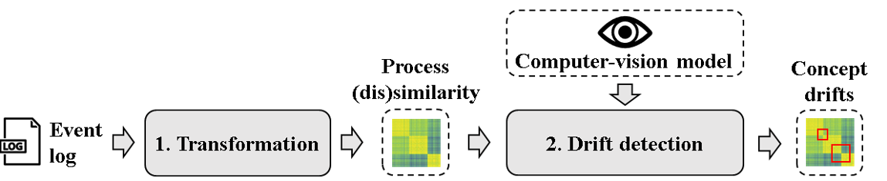

<a name="readme-top"></a>

# CV4CDD: A Computer Vision Approach for Concept Drift Detection in Process Mining
Concept drift in process mining refers to a situation where a process undergoes changes over time, leading to a single event log containing data from multiple process versions.
To avoid mixing these versions up during analysis, various approaches have been proposed to detect concept drifts.
Yet, the performance of these approaches, especially in situations involving noise or gradual drifts per log, is shown to be far from optimal. A possible cause for this is that existing approaches are developed according to algorithmic design decisions, operating on assumptions about how drifts manifest themselves in event logs, which may not always reflect reality.
In light of this, we propose a completely different approach, using a machine learning model that we trained to learn to recognize drift, rather than depend on design decisions. Our approach uses an image-based representation that visualizes differences in process behavior over time, which enables us to subsequently apply a state-of-the-art object detection model to detect concept drifts. Our experiments reveal that our approach is considerably more accurate and robust than existing approaches, highlighting the promising nature of this new paradigm.





<!-- GETTING STARTED -->
## Getting Started
To run the approach, follow these steps.


### Prerequisites
For full functionality, this repository requires the following software:
* Python 3.9
* TensorFlow Model Garden ([clone here](https://github.com/tensorflow/models))
* [poetry](https://python-poetry.org/) -> for packaging/dependency management, see their website for installation and usage


### Installation
1. Clone the repo
2. Go into the project root directory
3. Install dependencies with poetry: 'poetry install'. This creates a virtual environment with the corresponding dependencies.

<p align="right">(<a href="#readme-top">back to top</a>)</p>

<!-- USAGE EXAMPLES -->
## Usage

To use a pretrained computer-vision model, use the [predict](approaches/object_detection/predict.py) script.
Always start a poetry shell, if you use the terminal:
```sh
   poetry shell
```
```sh
   cd approaches/object_detection
```
```sh
   python predict.py --model-path <specify path of unzipped pretrained model> --log-dir <specify directory where event logs are stored> --encoding winsim --n-windows 200 --output-dir <specify output directory>
```

The script outputs not only the visual detection of the drift types, but also a detailed report that specifies the drift moments on traces.

### Evaluation
Results from the evaluation can be found [here](EvaluationResults/).

### Data and fine-tuned models
All datasets and fine-tuned models are available for download [here](https://huggingface.co/pm-science/cv4cdd_project/tree/main).

<p align="right">(<a href="#readme-top">back to top</a>)</p>


<!-- LICENSE -->
## License

Distributed under the MIT License. See `LICENSE.txt` for more information.

<p align="right">(<a href="#readme-top">back to top</a>)</p>